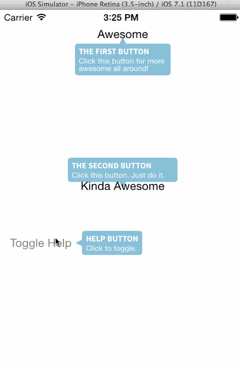

# ProductTour
ProductTour is a library for creating interactive product tours within your Xamarin.iOS applications. This library is based entirely off [ProductTour](https://github.com/Cclleemm/ProductTour) from Clément Raussin.

### Features
* Single or multiple-line descriptions
* Color and font customization
* Up, down, left, and right arrow directions
* Animations for dismiss/appear bubbles

### Integration
#### Out-of-the-Box

		void SetupProductTour ()
		{
			// Create product tour
			var productTour = new ProductTour ();
			productTour.Frame = new RectangleF (0, 0, View.Bounds.Width, View.Bounds.Height);

			// Create help bubbles
			var bubble = new Bubble (AwesomeButton, "THE FIRST BUTTON", "Click this button for more\nawesome all around!", ArrowPosition.Top, null);
			// You can even assign custom fonts!
			bubble.FontName = "SourceSansPro-Bold";

			var bubble2 = new Bubble (KindaAwesomeButton, "THE SECOND BUTTON", "Click this button. Just do it.", ArrowPosition.Bottom, null);
			bubble2.FontName = "SourceSansPro-Bold";

			var bubble3 = new Bubble (HelpButton, "HELP BUTTON", "Click to toggle.", ArrowPosition.Right, null);
			bubble3.FontName = "SourceSansPro-Bold";

			// Let the product tour know what bubbles to show!
			var bubbleArray = new NSMutableArray (3);
			bubbleArray.Add (bubble);
			bubbleArray.Add (bubble2);
			bubbleArray.Add (bubble3);
			productTour.Bubbles = bubbleArray;

			// Add the product tour to the view
			Add (productTour);
		}

		void ToggleHelp ()
		{
			// Toggle the visibility of the tour
			var visible = !productTour.IsVisible;
			productTour.Visible = visible;
		}
		
#### Building from Scratch
Why would I want to build from scratch, you may ask? 

* Dll included is built using a FAT assembly, or one that accounts for all architectures (to be more friendly)
* To customize bubble size, padding, or font
* Awesome tweaks from the wish list

To do this, open the .xcodeproj file, make the necessary changes, and build. Next, copy over the .a static library produced by Xcode into the binding directory. Overwrite the current file. Rebuild the binding and you're done! :)

### License
ProductTour is [licensed under Apache 2.0](https://tldrlegal.com/license/apache-license-2.0-(apache-2.0)), per the original work.
